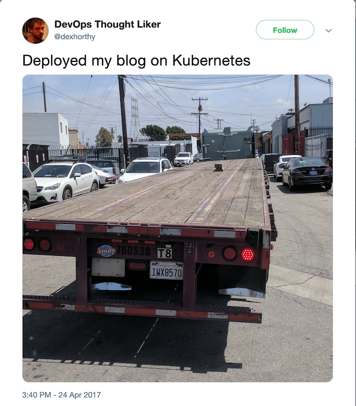
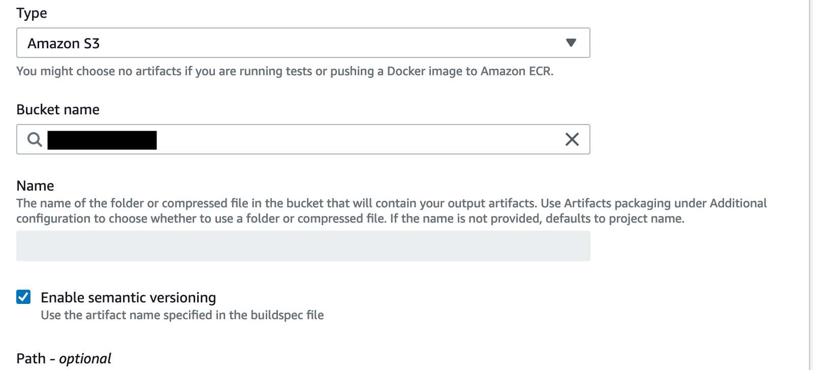

This month, I ended up biting the bullet and going for my AWS Professional DevOps Engineer Certification. Obviously, CI/CD was a major part of the exam. Now, a sane person who works in the field (I am the latter, the former is debatable) would focus on Jenkins, and maybe some Bamboo or Spinnaker, since those are the players in CI/CD. But, of course, this is AWS, so there's a service for that!

AWS CodeBuild is a part of the AWS Development suite: CodeCommit, CodeBuild, CodeDeploy, and CodePipeline. In my notes, I started referencing them as Code*, but it turns out CodeStar is - you guessed it - the hub for all the Code services. CodeBuild - as the name suggests - lets you run a build job, based your code. AWS runs the builds in a managed container environment with the runtime of your choosing. There are a few prepared options, or you can bring your own image. 

I decided to get my hands dirty and see how it worked - I've mostly used Jenkins up to this point, and I'm wasn't sold on a CSP specific solution - I have similar/identical reservations about GCP's CloudBuild. Now, working mostly in python, I don't have many projects that need to be build. The only thing in my GH that seemed a candidate was this - my blog. Now, on th one hand, I know I should be ashamed, as a DevOps engineer, that my blog is manually deployed. But I prefer that to this:



So, I decided the stars aligned, and I would set up my blog to deploy to the staging environment every time I pushed to GitHub. 

The process was fairly straightforward- CodeBuild uses a `buildspec.yml` much like a `Jenkinsfile`, except its, y'know, YAML. Not having much experience in Groovy, I found that a good choice- YAML is ubiquitous enough at this point that, if you're not comfortable with it, its multipurpose enough to be worth the time to learn. Mine was less than 20 lines:
```
  install:
    runtime-versions:
      nodejs: 10
    commands:
      - echo 'installing gatsby'
      - npm install --global yarn 
      - npm install --global gatsby-cli
  build:
    commands:
      - echo 'building static bundle'
      - yarn
      - gatsby build
  post_build:
    commands:
      - echo 'copying site to sb bucket'
      - aws s3 cp public s3://my_staging_bucket/ --recursive --region us-east-1 --acl public-read
```

Now, if you're familiar with CodeBuild, you might be noticing I'm doing a few things __very__ incorrectly. First, CodeBuild is designed to, well, build artifacts. It has a whole section of the buildspec file where you can tell it what bucket to put the artifact in, which is what I wanted for a bucket-hosted static site. Theoretically, this should have been all I needed to skip the post_build step altogether:
```
artifacts:
  files:
  - public/**/*
  discard-paths: yes
  base-directory: '.'
```

I mean, its right in the [docs](https://docs.aws.amazon.com/codebuild/latest/userguide/sample-disable-artifact-encryption.html). However, every time I ran the build, I found that I would put the `public` directory into a directory with build details, rather than in the root of the bucket. After [poking](https://docs.aws.amazon.com/codebuild/latest/userguide/build-spec-ref.html#runtime-versions-buildspec-file) around, I found someone else who had my idea [first](https://nishantdania.com/blog/ghost-gatsby-part-4-setting-up-aws-codebuild-for-auto-deploying-the-site/). Using `aws s3 cp` felt like cheating, but I had to memorize the other 164 AWS services. 

I also found that having to configure the trigger as a CodePipeline somewhat overengineered. In all my spare time, a webhook-SNS-Lambda solution may be a more cost effective choice. 

In conclusion, I don't hate CodeBuild as much as I kinda wanted to. It's a tool that, in specific use cases, works really well. If you only have a few jobs- not enough to justify a Jenkins server, or if you have no CI/CD footprint, it may be a no-ops, low-overhead solution. But I don't think its worth migrating from Jenkins just for the benefits. 
