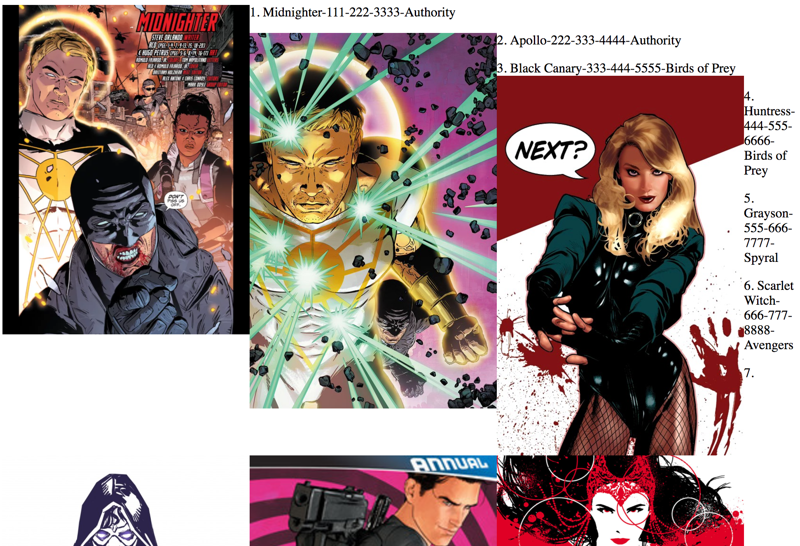

#### Checking in on Web Dev

I came to cloud computing via web development, and its a skill set that I greatly admire/covet. I appreciate the ability to take some code, throw it out there, and have something that anyone with a computer or phone can see and use. I try to keep up with the comings and goings of web dev world, but often it falls off the table between CSPs, IaC frameworks, pipeline tools, and everything else that I _need_ to keep up with.  But when I realized that I didn't want all my markdowns to languish in my [Github](github.com/justwes2), the needs of the task aligned with the backlogged learning. Here's what I found coming back to web dev.

I found Gatsby had a number of quirks, some because I'm not a front end developer, and others I think are more a reflection of the tech landscape. As with many frameworks, it does what it's intended to do very well, and give a lot of room to grow into the needs of the developer. While most of the 100 level work I did worked really well, I found that for the 200 level functionality, the opinionatedness (yes that's a word- I [checked](https://www.merriam-webster.com/dictionary/opinionated)) fell off before I was oriented enough to drive without GPS. 

#### JAM Stack

When I wrote my first portfolio, I used a simple React frontend, and just didn't attach a backend. It worked well to hold the dozen or so pieces of data I needed it to have, and it was simple to host- first through github pages, then through surge.sh, and finally, in as S3 bucket. As I started hearing about JAM stack (JavaScript, APIs, Markup) as the next cool thing in web dev, it caught my eye, since attaching an api call to a static frontend to dynamically populate data is a common serverless framework that I could support with a mix of cloud services that I work with regularly. I did some reading on a few options, and settled on Gatsby as a first stop. Its Remark Transformer supports markdown articles without much configuration, and most of my other needs seemed either supported via plugin, or doable with custom components. 

#### Is this really JavaScript?

Working in React and JSX, I definitely found the medium moved passed vanilla JavaScript, but Gatsby is so specialized in purpose and so extensible with its plugins, that it's moved more to the realm of a domain specific language- a la Chef. This could be that I've been out of the JS game and this is just where that world is, but the Codewars JS Kata I would attempt periodically didn't really have much overlap with the kinds of problems I was dealing with in Gatsby. But really, most of the problems I had weren't with code, so JavaScipt was an effective tool to express my intention in a machine-readable way, which is really all one could ask. 

The biggest hurdles I faced were error messages. I had one error that I encountered a few times in the initial build, and I had to just do a `git reset` to undo, since I couldn't figure out what the problem was (remember kids, always be committing!).

The error looked like this:
```
Failed to validate error Error [ValidationError]: child "error" fails because
["error" must be an object]
    at Object.exports.process (repo/node_m
odules/@hapi/joi/lib/errors.js:202:19)
    at internals.Object._validateWithOptions (repo/node_modules/@hapi/joi/lib/types/any/index.js:764:31)
    at module.exports.internals.Any.root.validate (repo/node_modules/@hapi/joi/lib/index.js:145:23)
    at constructError (repo/node_modules/g
atsby/node_modules/gatsby-cli/lib/structured-errors/construct-error.js:28:29)
    at Object.error (repo/node_modules/gat
sby/node_modules/gatsby-cli/lib/reporter/index.js:100:29)
    at Object.panicOnBuild (repo/node_modu
les/gatsby/node_modules/gatsby-cli/lib/reporter/index.js:66:24)
    at repo/node_modules/gatsby/dist/utils
/api-runner-node.js:359:16
    at tryCatcher (repo/node_modules/blueb
ird/js/release/util.js:16:23)
    at Promise._settlePromiseFromHandler (repo/node_modules/bluebird/js/release/promise.js:517:31)
    at Promise._settlePromise (repo/node_m
odules/bluebird/js/release/promise.js:574:18)
    at Promise._settlePromise0 (repo/node_
modules/bluebird/js/release/promise.js:619:10)
    at Promise._settlePromises (repo/node_
modules/bluebird/js/release/promise.js:695:18)
    at _drainQueueStep (repo/node_modules/
bluebird/js/release/async.js:138:12)
    at _drainQueue (repo/node_modules/blue
bird/js/release/async.js:131:9)
    at Async._drainQueues (repo/node_modul
es/bluebird/js/release/async.js:147:5)
    at Immediate.Async.drainQueues [as _onImmediate] (repo/node_modules/bluebird/js/release/async.js:17:14) {
  isJoi: true,
  name: 'ValidationError',
  details: [
    {
      message: '"error" must be an object',
```
Now, I tore through my code, commenting out component by component, trying to figure out what caused this error, 'cause the error itself- not super helpful. After going through my git log, I started deleting unused assets one at a time, and found that when `src/images/gatsby-icon.png` was deleted, it caused this error. I thought that the png file was referenced in the default `Image` component, which I didn't use. It was only when I was trying to replicate this error for this writeup that I realized the png was referenced in the `gatsby-config.js`. Maybe I just don't know how to read node/gatsby errors, but I'm having trouble calling this user error. 

#### Style - Do whatever you want, but not that...

Let me preface this by saying I'm not great with css/styling. The color scheme I chose for a mental health tracking app- which I thought was serene and calming- made my classmate depressed, so I will never try to pin bad design on a library or framework. 
My frustration with Gatsby is that it has a very 'anything goes' attitude, but that implements a few different ways, without giving new users a great understanding of the pros and cons of an approach. For instance, css styles can be added inline with the component, or as a specific style sheet, or just using a global stylesheet. I opted for this approach- porting over the stylesheet from my last project, and referencing those class names. However, the Gatsby starter kit comes with a `layout.css` in addition to a number of components having inline styling. Additionally, the tutorials are split on how to manage these styles. It was only through trial, error, and liberal use of the browser's inspect feature that I could figure out what styles were coming from where, and how Gatsby decided precedence. 

My web dev peeps have stressed the inline vs style sheets for components debate isn't Gatsby specific- apparently its the newer, more specific version of Tabs vs Spaces. I think what I was looking for was more opinion in the starter kit. When I run `gatsby new`, the starter code has a `layout.css` with global styles, but components have their own inline styles. As an infrequent traveler of these lands, I think I would have preferred one or the other- let me start with a set of stylesheets and if I decide to defect to the inliners, I can burn all my stylesheets or vice versa. 



This also surfaced when I was updating the metadata. The docs I found all suggested I use the `react-helmet` package to add a helmet to the `seo.js`- which worked well for most metadata, but I also found some metadata in the `gatsby-config.js` file. I appreciate that the framework is un-opinionated, and supports a bunch of development workflows, but a consistent default approach might make the tool more new user friendly. 

#### GraphQL - not another NoSQL implementation?

In an age where it seems every day there's another NoSQL, document-based, or otherwise unstructured querying language, I was nervous about GraphQL when I started reading. In my last web app- my portfolio- I stored most of my data in a JSON object and just imported that file everywhere I needed it. I thought it was clever at the time, and it accomplished my purpose- I could iterate through my projects and pull the data that I needed without a database/backend, which would have increased my costs. From my perspective, GraphQL is a scalable version of this approach- it consumes data from whatever sources the transformer plugins give it access to- and allows for queries of all that data anywhere in the app. For the use case of a 13 page blog, this is like asking a quantum computer to help with basic arithmetic, but like with the JavaScript of the app, it serves its purpose, and offers lots of extensibility that I probably won't get to take advantage of. Its like a gym membership, I suppose. 

#### Final Thoughts

I don't intend to 'review' Gatsby, given how little of this world I know, that would be like asking me to review an opera. In the end, Gatsby got me what I needed- a simple app that I can easily add to and deploy without much effort, that supports my use case, and that has the potential to let me grow the site in a number of ways. 