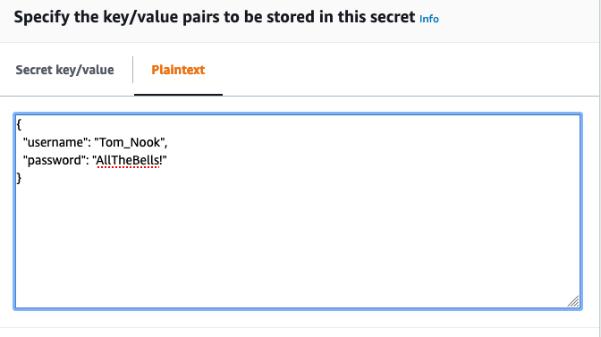

### Shh... It's a Secret

Its been a few posts since I've mentioned my adoration for Hashicorp and its products, so we're due. But this time, its a bit bittersweet. But I'm getting ahead of myself, lets start from the beginning.

#### Credentials in AWS Lambda

I'm working on a Lambda Function, and, like a good little Dev_Sec_Ops engineer, I've got it wired up to a CI/CD pipeline to automate updates. The problem is that I'm now capturing the entirety of my code and configuration in a GitHub repo. I need a way to manage information that I don't want to put into version control- stuff like API keys. 

"But dear author," I can hear you say, "Environment variables have long been used to manage this issue, and Lambda does support env vars, so what is the problem?"

"Well, my astute reader," I respond, "Lambda does support environment variables, and I am indeed using them to manage configurations in my non-production and production environments. However, my CI/CD pipeline also manages my infrastructure, so those variables are defined in code. For non-secret values, this makes my life much easier."

Okay, enough of the socratic method here- you can tell I'm in isolation #covidparty2020. 

So, if you couldn't follow the dialogues, I have a lambda function with a pipeline where the env vars are defined in the infrastructure as code. So, I need a different tool to manage values that I don't want to be accessible. Normally, I would look to [Hashicorp Vault](https://www.vaultproject.io/), because I am Hashicorp fanboy, as mentioned above. However, Vault is not something I can just deploy and go- and even once its deployed, who's gonna keep it updated? I can't even keep houseplants alive. So, since I can't commit to Vault for two strings for one Lambda Function, I needed to look elsewhere. And now, we have arrived at what I actually wanted to explore- [Amazon Secrets Manager](https://docs.aws.amazon.com/secretsmanager/index.html). 

#### Getting Secrets into ASM

Storing secrets is very straightforward. You can store credentials for RDS, credentials for DocumentDB, Credentials for RedShift, Credentials for another DB, or anything else. Anything else can either look like a key/value pair, or plaintext (which still supports JSON objects):



So far so good. Next you can choose a key. I went with the default KMS key- if I'm not committing to maintenance, I'm not committing to maintenance. 

*Disclaimer*: _I'm not a security specialist- I don't know enough to say whether that's good enough for your needs or not._

#### Getting Secrets out of ASM

So secret in ASM, now to get it out. Actually, AWS very helpfully provides starter code to access the secret in a number of languages. I tested it and it worked as expected- returning an object with the values I'd stashed. I'm not going to paste it here- its like 60 lines, lots of error handling.

#### Getting Secrets into Lambda

Being able to run a script with my user credentials to access the secret is one thing- I have admin rights. I'm not interested in giving a Lambda Function admin rights- PoLP (Principle of Least Privilege) is your friend! 

I went into the IAM console to look at the permissions associated with ASM. There was one called `GetSecretValue`. Looks good. I created a policy like so:

```
{
    "Version": "2012-10-17",
    "Statement": [
        {
            "Effect": "Allow",
            "Action": "secretsmanager:GetSecretValue",
            "Resource": "arn:aws:secretsmanager:us-east-1:<ACCOUNTID>:secret:nookdata-XGxjAe"
        }
    ]
}
```
And attached it to a Lambda Function Role. I dropped the code ASM generated in the Lambda, invoked the `get_secret()` function (little f function for functions within the code, vs big F Functions for a Lambda Function with an ARN and everything), and bam:

```
{'ARN': 'arn:aws:secretsmanager:us-east-1:<ACCOUNTID>:secret:nookdata-XGxjAe', 'Name': 'nookdata', 'VersionId': '1ca71783-298e-466a-88cf-14796b5722fa', 'SecretString': '{"username":"Tom_Nook","password":"AllTheBells!"}', 'VersionStages': ['AWSCURRENT'], 'CreatedDate': datetime.datetime(2020, 4, 2, 22, 54, 52, 766000, tzinfo=tzlocal()), 'ResponseMetadata': {'RequestId': 'd72c1f0c-5333-4228-83a4-786cb7032660', 'HTTPStatusCode': 200, 'HTTPHeaders': {'date': 'Fri, 03 Apr 2020 00:37:42 GMT', 'content-type': 'application/x-amz-json-1.1', 'content-length': '313', 'connection': 'keep-alive', 'x-amzn-requestid': 'd72c1f0c-5333-4228-83a4-786cb7032660'}, 'RetryAttempts': 0}}
END RequestId: f229f0cb-d6d4-4297-bccd-c49b2587c103
REPORT RequestId: f229f0cb-d6d4-4297-bccd-c49b2587c103	Duration: 1016.30 ms	Billed Duration: 1100 ms	Memory Size: 128 MB	Max Memory Used: 69 MB	Init Duration: 255.49 ms	
```
My Lambda is able to access secrets, without having to commit them to source code anywhere!

### Conclusion

I honestly expected this to be more fraught. I didn't encounter any error or problems. Granted, this was a use case bordering on trivial- not custom key encryption, no automatic rotation of the key, no bells or whistles. But it solves a very real challenge, so good on AWS, I guess. 